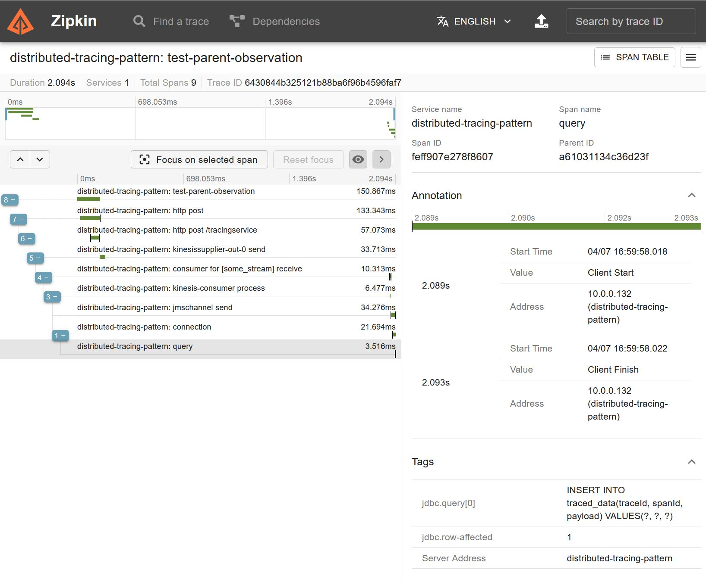

= Distributed Tracing

The https://microservices.io/patterns/observability/distributed-tracing.html[Distributed Tracing] requires from us a specific instrumentation in our services on some critical points to be able to restore a single request execution spanned throughout those services.
Chris Richardson talks about Spring Cloud Sleuth on his site, but that one is already deprecated in favor of https://micrometer.io/docs/observation[Micrometer Observation] adopted as a first class instrumentation API in all the Spring portfolio projects.
Spring Boot provides an auto-configuration for the `ObservationRegistry`, including Brave tracing (or Open Telemetry) and Zipkin publication.

You need to have https://zipkin.io/pages/quickstart[Zipkin] running on a default port in your localhost, so the application can export its spans over there according to the auto-configuration.
The application doesn't fail without this one, though, just a plain error in logs that no connection to respective host.
We cannot have Zipkin as a part of our Testcontainers solution in the project unit test since its container is going to be destroyed after test finishes.
With an external Zipkin you will be able to see traces from its Web UI any time and even compare them from different application runs.

The `DistributedTracingApplication` consists from two logically independent microservices.
The first one receives an HTTP request via https://docs.spring.io/spring-framework/docs/current/reference/html/web-reactive.html#webflux[WebFlux] (the mapping path is `/tracingService`) and put the record into AWS Kinesis stream `SOME_STREAM` using a respective binder for Spring Cloud Stream.
The second service consumes the record from that stream via the mentioned binder as well.
Then it stores received data into embedded H2 database (`traced_data` table) and publish a message into a JMS `SOME_QUEUE` destination on the embedded ActiveMQ Artemis broker.

We have both microservices in a single Spring Boot application, so we can simply run it in a JUnit test where, in addition to the mentioned embedded DB and JMS broker, we also ensure a Localstack started as a Docker container via https://www.testcontainers.org[Testcontainers] library.
Plus in the test we can perform additional logic relevant to the client of our "distributed" service.

This sample is not strictly a demonstration of Spring Integration features, but rather a combination of different Spring portfolio projects with respective observability tooling auto-configured for us by Spring Boot and Spring Cloud.
In addition, we use a https://jdbc-observations.github.io/datasource-micrometer/docs/current/docs/html[Datasource Micrometer] library to have an observation instrumentation around database operations, which is useful to have attached as a span into our distributed trace.
See link:src/main/resources/application.properties[`application.properties`] for configuration we apply in this Microservices "composite" application:

- the Kinesis producer and consumer are bound to respective Kinesis stream via Spring Cloud Stream;
- an observation is enabled for Kinesis binder;
- we expose `traceId` and `spanId` MDC variables into our logs to observe tracing in action;
- the `jdbc.includes=QUERY` is an option for the mentioned Datasource Micrometer library to observe queries we perform against database;
- since there is no observation instrumentation for JMS, we simulate it via an observation enabled on the `jmsChannel` used as an input channel for the `jmsFlow` in our consumer microservice.

The WebFlux we use to initiate a distributed request is instrumented with an observation automatically.

See also link:src/test/resources/schema.sql[`schema.sql`] for a table structure we are going to store the data alongside with the tracing info.
Just for informative purpose and to confirm that distributed tracing works as it is claimed by the instrumentation provided in Spring projects.

So, how it works:

- the `DistributedTracingApplicationTests` starts some `test-parent-observation` for a demonstration purpose and verification in the end that all the services were performed within the same trace;
- then this `Observation` instance is set to the Reactor context for the `WebClient` request;
- this `Observation` is used then as a parent for an observation around `WebClient` request-reply execution.
It is done automatically by the WebFlux framework;
- the WebFlux server receives an HTTP request, restores an observation from its headers and starts a new server-side one.
This is also done by the WebFlux framework automatically;
- a reactive `Publsiher` wrapper for that `IntegrationFlow` is used as a source for Spring Cloud Function `Supplier` which is bound to the Kinesis binder on a `SOME_STREAM` destination;
- the `doOnNext()` with log message is used to confirm that we are still in the same trace;
- since we have enabled an observation on the binder, its producer starts a new observation (and therefore span for the current trace);
- an observation information is serialized by the Brave tracer into message headers and this message is serialized into Kinesis record body since Kinesis does not support headers abstraction;
- the Kinesis consumer on a `SOME_STREAM` destination, from the other side, deserializes the message from a record and restores observation information from headers.
Then it starts a new its own observation;
- the `publishSubscribeChannel()` of the `IntegrationFlow` distributes the message two database an JMS queue in parallel;
- to make the parallel distributed observation-aware we use a `ContextExecutorService` wrapper from the `context-propagation` library;
- the JDBC operation is observed with the mention Datasource Micrometer library;
- the JMS operation observation is emulated around the channel and its subscriber producing to JMS queue;
- in the end of test we use a `traceId` from the `test-parent-observation` started in the beginning to verify that JMS message and data stored in the DB have exactly the same trace id.

All log messages we emit from this application are for the tracing information propagation down to the MDC and to confirm that one request is perform within a single trace:

[source,console]
----
2023-04-07T16:59:56.067-04:00 TRACE [distributed-tracing-pattern,6430844b325121b88ba6f96b4596faf7,19ff1630b72bea74] 11832 --- [ctor-http-nio-6] o.s.i.microservices.distributedtracing   : HTTP request to trace: GenericMessage [payload=test data, headers={}]
2023-04-07T16:59:56.069-04:00 TRACE [distributed-tracing-pattern,6430844b325121b88ba6f96b4596faf7,19ff1630b72bea74] 11832 --- [ctor-http-nio-6] o.s.i.m.d.DistributedTracingApplication  : Send message to Kinesis: GenericMessage [payload=test data, headers={}]
2023-04-07T16:59:57.987-04:00 TRACE [distributed-tracing-pattern,6430844b325121b88ba6f96b4596faf7,0827e2943074baf8] 11832 --- [esis-consumer-1] o.s.i.microservices.distributedtracing   : Received message from Kinesis: GenericMessage [payload=test data, headers={}]
2023-04-07T16:59:57.989-04:00 TRACE [distributed-tracing-pattern,6430844b325121b88ba6f96b4596faf7,0827e2943074baf8] 11832 --- [pool-3-thread-1] o.s.i.microservices.distributedtracing   : Save message to DB: GenericMessage [payload=test data, headers={}]
2023-04-07T16:59:57.990-04:00 TRACE [distributed-tracing-pattern,6430844b325121b88ba6f96b4596faf7,bdbd14425893b06d] 11832 --- [pool-3-thread-2] o.s.i.microservices.distributedtracing   : Send message to JMS: MutableMessage [payload=test data, headers={}]
----

And here is a result of some run of `DistributedTracingApplicationTests`:

.The sample of some trace in this application(s)

Right, as we discussed before, for simplicity all the microservices are part of a single Spring Boot application.
That's why we see only `1` service on the picture.
Two last spans for JDBC `INSERT` and JMS publishing are shown in parallel because we do produce them in parallel via `publishSubscribeChannel()` from an `IntegrationFlow` on the Kinesis Binder consumer.

== Spring Boot and Spring Integration resources

* https://docs.gradle.org[Official Gradle documentation]
* https://docs.spring.io/spring-boot/docs/current/gradle-plugin/reference/html[Spring Boot Gradle Plugin Reference Guide]
* https://docs.spring.io/spring-boot/docs/current/reference/htmlsingle/#messaging.spring-integration[Spring Integration]
* https://docs.spring.io/spring-integration/reference/html/dsl.html[Spring Integration Java DSL Reference Guide]
* https://docs.spring.io/spring-integration/docs/current/reference/html/jdbc.html#jdbc[Spring Integration JDBC Reference Guide]
* https://docs.spring.io/spring-integration/docs/current/reference/html/jms.html#jms[Spring Integration JMS Reference Guide]
* https://micrometer.io/docs/tracing[Micrometer Tracing Reference Guide]
* https://jdbc-observations.github.io/datasource-micrometer/docs/current/docs/html/[Datasource Micrometer Reference]
* https://github.com/spring-cloud/spring-cloud-stream-binder-aws-kinesis/blob/main/spring-cloud-stream-binder-kinesis-docs/src/main/asciidoc/overview.adoc[Cloud Stream AWS Kinesis Binder]
